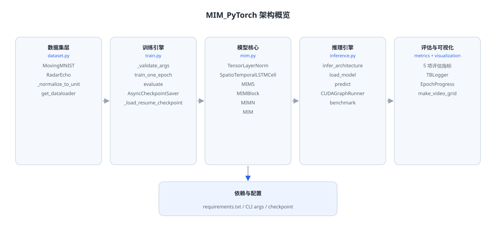
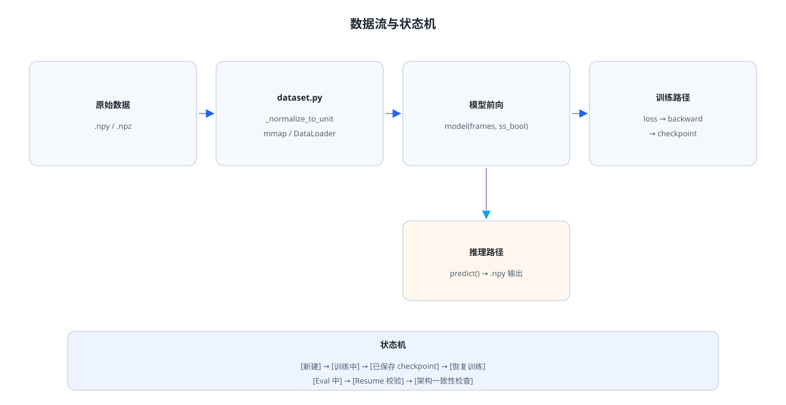

# MIM_PyTorch

基于 PyTorch 的 Memory In Memory Networks 生产级复现,提供可部署、可复现、可扩展的时空帧预测能力。

[](https://github.com/Yunbo426/MIM_PyTorch/actions/workflows/ci.yml)
[](https://www.python.org/downloads/)
[](https://pytorch.org/)
[](LICENSE)

> **论文:** Memory In Memory: A Predictive Neural Network for Learning Higher-Order Non-Stationarity from Spatiotemporal Dynamics
> **会议:** CVPR 2019
> **PDF:** https://arxiv.org/pdf/1811.07490.pdf
> **官方 TensorFlow 仓库:** https://github.com/Yunbo426/MIM

---

## 目录

- [论文概述](#论文概述)
  - [问题定义](#问题定义)
  - [核心思想](#核心思想)
  - [主要贡献](#主要贡献)
- [特性](#特性)
- [安装](#安装)
- [快速开始](#快速开始)
  - [训练](#训练)
  - [推理](#推理)
- [输入数据格式](#输入数据格式)
- [核心参数](#核心参数)
  - [训练参数](#训练参数)
  - [推理参数](#推理参数)
- [项目结构](#项目结构)
- [模块详解](#模块详解)
  - [mim.py — 模型核心](#mimpy--模型核心)
  - [dataset.py — 数据层](#datasetpy--数据层)
  - [train.py — 训练引擎](#trainpy--训练引擎)
  - [inference.py — 推理引擎](#inferencepy--推理引擎)
  - [metrics.py — 评估层](#metricspy--评估层)
  - [visualization.py — 可视化层](#visualizationpy--可视化层)
- [数据流与状态机](#数据流与状态机)
- [测试](#测试)
- [贡献指南](#贡献指南)
- [许可证](#许可证)
- [致谢](#致谢)

---

## 论文概述

### 问题定义

视频帧预测(Video Frame Prediction)是时空动态建模的核心任务。传统方法难以有效建模高阶非平稳性(higher-order non-stationarity),即时空动态中随时间演变的复杂分布变化。

### 核心思想

Memory In Memory (MIM) 网络通过两层嵌套的记忆结构建模高阶非平稳性:

- **主记忆(main memory)**: 编码当前时间步的时空上下文
- **差分记忆(differential memory)**: 捕捉相邻时间步之间的高阶变化趋势

这种记忆-差分记忆的级联结构,使模型能够学习动态演化的分布,而非假设静态统计特性。

### 主要贡献

1. **高阶非平稳性建模**: 通过嵌套记忆结构显式建模时空动态中的分布变化
2. **差分模块(MIMN)**: 捕获高阶动态的差分信号,与主记忆协同工作
3. **Scheduled Sampling**: 训练时逐步从真实帧过渡到预测帧,减少暴露偏差
4. **广泛适用性**: 在 Moving MNIST、Radar Echo、KTH Action 等多个基准上取得最优性能

---

## 特性

- **训练稳定性**: AMP 混合精度、梯度裁剪、NaN 三层防护、Scheduled Sampling
- **推理性能**: CUDA Graphs、channels_last Tensor Core 路径、fp16 推理
- **工程安全**: 输入维度校验、checkpoint 安全加载、并发安全、5 GiB 文件大小上限
- **可维护性**: 模块化架构、类型提示、167 项单元测试全通过
- **生产就绪**: 异步原子化 checkpoint、梯度重计算、`torch.compile` 支持

---

## 安装

```bash
pip install -r requirements.txt
```

**依赖版本:**

| 依赖 | 版本约束 | 用途 |
|---|---|---|
| Python | `>=3.10` | 运行时 |
| PyTorch | `>=2.5.1,<3` | 核心深度学习框架 |
| numpy | `>=1.26,<3` | 数据 I/O 与数组运算 |
| tqdm | `>=4.66,<5` | 训练进度显示(硬依赖) |
| tensorboard | `>=2.15,<3` | 训练可视化日志 |

**可选开发依赖:**

```bash
pip install pytest ruff bandit pip-audit
```

---

## 快速开始

### 训练

```bash
python train.py \
  --data_path data/mnist_test.npy \
  --dataset mnist \
  --batch_size 8 \
  --epochs 50 \
  --input_length 10 \
  --total_length 20 \
  --hidden_dim 64 64 64 64 \
  --save_dir ./checkpoints
```

**加速组合:**

```bash
python train.py \
  --data_path data/mnist_test.npy \
  --amp \
  --amp_dtype float16 \
  --grad_ckpt \
  --channels_last
```

**断点续训:**

```bash
python train.py \
  --data_path data/mnist_test.npy \
  --resume ./checkpoints/mim_epoch_10.pth
```

### 推理

```bash
python inference.py \
  --checkpoint ./checkpoints/mim_best.pth \
  --input input_frames.npy \
  --input_length 10 \
  --horizon 10 \
  --output pred.npy
```

**高性能推理:**

```bash
python inference.py \
  --checkpoint ./checkpoints/mim_best.pth \
  --input input_frames.npy \
  --input_length 10 \
  --horizon 10 \
  --use_cuda_graph \
  --precision float16 \
  --benchmark
```

---

## 输入数据格式

| 维度格式 | 含义 | 适用场景 | 示例形状 |
|---|---|---|---|
| `[T, H, W]` | 时间 × 高 × 宽 | 灰度视频帧序列 | `(20, 64, 64)` |
| `[T, C, H, W]` | 时间 × 通道 × 高 × 宽 | 多通道帧序列 | `(20, 3, 64, 64)` |
| `[B, T, C, H, W]` | 批 × 时间 × 通道 × 高 × 宽 | 批量推理 | `(8, 20, 1, 64, 64)` |

**支持 dtype:**

- `uint8`: 自动归一化到 `[0, 1]`
- `float16/32/64`: 需在 `[0, 1]` 范围内

**数据加载可视化:**

```text
.npy / .npz
    │
    ▼
_load_split() ──▶ mmap(.npy) / 完整读取(.npz)
    │
    ▼
_normalize_to_unit() ──▶ uint8 除以 255 / float 范围检查
    │
    ▼
DataLoader ──▶ batch / shuffle / prefetch
    │
    ▼
模型输入 [B, T, C, H, W]
```

---

## 核心参数

### 训练参数

| 参数 | 默认值 | 说明 | 约束条件 |
|---|---|---|---|
| `--data_path` | 必填 | 数据集路径 | 存在且可读 |
| `--dataset` | `mnist` | `mnist` / `radar` | 枚举值 |
| `--batch_size` | `8` | 批大小 | `>= 1` |
| `--epochs` | `100` | 训练轮数 | `>= 1` |
| `--input_length` | `10` | 输入帧数 | `>= 1` |
| `--total_length` | `20` | 序列总长 | `> input_length` |
| `--hidden_dim` | `[64,64,64,64]` | 每层隐藏通道 | 必须 uniform |
| `--kernel_size` | `3` | 卷积核 | 正奇数 |
| `--lr` | `0.001` | 学习率 | `> 0` |
| `--amp` | `False` | 启用 AMP | CUDA only |
| `--amp_dtype` | `float16` | `float16` / `bfloat16` | 枚举值 |
| `--grad_ckpt` | `False` | 梯度重计算 | 增加 1x 前向 |
| `--compile` | `False` | torch.compile | 实验性 |
| `--channels_last` | `False` | channels-last 格式 | CUDA only |
| `--resume` | `None` | 恢复 checkpoint | 架构必须一致 |

### 推理参数

| 参数 | 默认值 | 说明 | 约束条件 |
|---|---|---|---|
| `--checkpoint` | 必填 | checkpoint 路径 | `<= 5 GiB` |
| `--input` | 必填 | 输入 `.npy` 文件 | 存在且可读 |
| `--input_length` | `10` | 输入帧数 | `>= 1` |
| `--horizon` | `10` | 预测帧数 | `1..100000` |
| `--device` | `cuda` | `cuda` / `cpu` | - |
| `--use_cuda_graph` | `False` | CUDA Graphs 加速 | CUDA only |
| `--precision` | `float32` | `float32` / `float16` | fp16 需 CUDA |
| `--benchmark` | `False` | 打印平均延迟 | - |

---

## 项目结构

```text
MIM_PyTorch/
├── mim.py               # 模型核心:单元实现与前向逻辑
├── dataset.py           # 数据层:数据集抽象与 DataLoader 工厂
├── train.py             # 训练引擎:优化、调度、checkpoint、验证
├── inference.py         # 推理引擎:模型加载、预测、CUDA Graphs
├── metrics.py           # 评估层:5 项指标计算函数
├── visualization.py     # 可视化层:TensorBoard 与 tqdm 封装
├── requirements.txt     # 依赖声明
└── tests/               # 测试套件
```

**架构概览:**



```

┌─────────────    依赖与配置     ─────────────┐
│ requirements.txt / CLI args / checkpoint    │
└──────────────────────────────────────────────┘
                    ▼
┌─────────────    dataset.py     ─────────────┐
│ MovingMNIST / RadarEcho / _normalize_to_unit │
│ get_dataloader() / recommend_num_workers()   │
└──────────────────────────────────────────────┘
                    ▼
┌─────────────     train.py      ─────────────┐
│ _validate_args() / train_one_epoch()         │
│ evaluate() / AsyncCheckpointSaver            │
│ _load_resume_checkpoint() / _check_resume_args │
└──────────────────────────────────────────────┘
                    ▼
┌─────────────     mim.py        ─────────────┐
│ TensorLayerNorm / SpatioTemporalLSTMCell    │
│ MIMS / MIMBlock / MIMN / MIM                │
│ sequence_to_channels_last()                  │
└──────────────────────────────────────────────┘
                    ▼
┌───────────── inference.py      ─────────────┐
│ infer_architecture() / load_model()          │
│ predict() / CUDAGraphRunner / benchmark()    │
└──────────────────────────────────────────────┘
                    ▼
┌─────────────  metrics.py       ─────────────┐
│ batch_mse / batch_psnr / batch_ssim         │
│ batch_mae / csi_score                        │
└──────────────────────────────────────────────┘
                    ▼
┌───────────── visualization.py  ─────────────┐
│ TBLogger / EpochProgress / make_video_grid  │
└──────────────────────────────────────────────┘
```

---

## 模块详解

### mim.py — 模型核心

`mim.py` 实现了论文中的 Memory In Memory 网络结构,包含以下核心组件:

**关键类:**

- `TensorLayerNorm`: 通道级 LayerNorm,在 `[C, H, W]` 维度上进行归一化,内部使用 `fp32` 计算统计量以避免 `fp16` 溢出
- `SpatioTemporalLSTMCell`: 单层时空 LSTM 单元,维护 `hidden`(`h`)、`cell`(`c`)、`memory`(`m`) 三种状态,通过四门控机制建模时空依赖
- `MIMBlock`: 标准堆叠块,集成主分支(`x_cc`/`t_cc`/`s_cc` 空间-时间-记忆卷积)与差分分支(`mims`)
- `MIMN`: 差分模块,捕获非平稳高阶动态,参数初始化为 `±0.001` 均匀分布(忠实于原始实现)
- `MIMS`: 块内子单元,处理差分输入的时空建模,与 `MIMN` 配合形成完整差分路径
- `MIM`: 顶层容器,管理多层堆叠与时间维度的展开逻辑,维护 `5n-2` 状态元组

**辅助函数:**

- `sequence_to_channels_last(frames)`: 将 `[T, B, C, H, W]` 转换为 channels-last 布局,提升 Tensor Core 利用率
- `_tf_glorot_uniform_(tensor)`: 以 TensorFlow Glorot Uniform 方式初始化 `[C, H, W]` 权重,确保复现性
- `_validate_conv(kernel_size, in_shape)`: 校验卷积核为正奇数、输入为 4 维张量

**状态元组布局:** 前向传播返回 `5n-2` 项状态元组,其中每层产生 5 项(`st_memory`, `hidden`, `cell`, `hidden_diff`, `cell_diff`),顶层追加 `convlstm_c`。

### dataset.py — 数据层

`dataset.py` 负责数据加载、归一化与 DataLoader 工厂,支持 Moving MNIST 与 Radar Echo 两种数据集。

**关键类与函数:**

- `MovingMNIST`: 处理 `[T, N, H, W]` 布局的 Moving MNIST 数据集,支持 `.npy`/`.npz` 格式
- `RadarEcho`: 处理 `[N, T, H, W]` 或 `[N, T, C, H, W]` 布局的 Radar Echo 数据集
- `_normalize_to_unit(seq)`: 安全归一化函数,将 `uint8` 除以 255 归一化到 `[0, 1]`,对 `float16/32/64` 进行范围检查,拒绝 NaN/Inf 与超范围值
- `get_dataloader(...)`: DataLoader 工厂,自动处理 worker 数量、预取、内存钉扎
- `recommend_num_workers()`: 根据 `os.cpu_count()` 与设备类型自动推荐 worker 数量

**数据格式支持:**

- `.npy`: 使用 mmap 映射,减少 worker 内存占用
- `.npz`: 完整读取(压缩格式无法 mmap),自动提示内存占用

### train.py — 训练引擎

`train.py` 实现了完整的训练流程,包括异步 checkpoint、Scheduled Sampling、AMP 混合精度等生产级特性。

**关键类与函数:**

- `AsyncCheckpointSaver`: 异步原子化 checkpoint 写入器,使用 `ThreadPoolExecutor(max_workers=2)` 后台写入,通过唯一 tmp 文件名(`进程ID.线程ID.tmp`)避免并发冲突,`os.replace()` 完成原子替换
- `_validate_args(args)`: 启动前参数校验,在训练开始前拒绝所有违反约束的 CLI 值
- `_load_resume_checkpoint(path, model, optimizer, device)`: Resume checkpoint 安全加载器,包含 5 层校验(文件大小、必需键、键白名单、类型校验、架构一致性)
- `train_one_epoch(...)`: 单 epoch 训练主循环,支持 AMP、梯度重计算、Scheduled Sampling、NaN loss 防护
- `evaluate(...)`: 评估主循环,`drop_last=False` 严格计分,跳过异常 batch
- `generate_ss_bool(batch_size, total_length, input_length, prob)`: 生成 `[B, T]` 布尔掩码,控制 teacher forcing 策略
- `get_scheduled_sampling_prob(current_epoch, start_epoch, stop_epoch, initial_prob, final_prob)`: 线性插值计算当前 scheduled sampling 概率

**安全特性:**

- NaN/Inf 梯度检测:`_check_grad_norm_finite` 拒绝非有限梯度
- NaN loss 防护:异常 batch 自动跳过
- 梯度裁剪:防止梯度爆炸

### inference.py — 推理引擎

`inference.py` 提供滚动自回归预测、CUDA Graphs 加速、延迟基准测试等功能。

**关键类与函数:**

- `infer_architecture(state_dict, height, width)`: 从 checkpoint 的 `state_dict` 自动推断模型架构(input_dims、hidden_dim、kernel_size、height、width、tln)
- `load_model(checkpoint, device)`: 构建模型并安全加载权重,包含 5 GiB 文件大小检查与 `weights_only=True` 安全反序列化
- `predict(model, frames, horizon)`: 滚动自回归预测,支持 horizon 步长预测,内置线程安全锁(`RLock`)与资源上限检查(`<=100_000`)
- `CUDAGraphRunner`: CUDA Graphs 捕获与回放,支持静态形状固定、预热、形状不匹配时自动回退到 eager 模式
- `benchmark(model, frames, horizon, warmup_iters)`: 延迟基准测试,返回平均毫秒数
- `load_input(path, input_length)`: 安全输入加载,支持 `.npy` 格式与 dtype 白名单
- `pad_frames(frames, input_length)`: 帧补齐,当输入帧数不足时进行零填充

**并发安全:**

- `_predict_lock`(`RLock`): 串行化推理请求,防止并发状态冲突

### metrics.py — 评估层

`metrics.py` 提供 5 项评估指标,全部采用数值保护机制:

| 函数 | 公式 | 数值保护 |
|---|---|---|
| `batch_mse(pred, target)` | `mean((pred - target)^2)` | - |
| `batch_psnr(pred, target, data_range)` | `10 * log10(data_range^2 / (mse + eps))` | `eps=1e-10` |
| `batch_ssim(pred, target, data_range)` | 全局 SSIM | `floor_std=1e-3 * data_range` 防低对比度退化;全零输入返回 `1.0` |
| `batch_mae(pred, target)` | `mean(\|pred - target\|)` | - |
| `csi_score(pred, target, threshold)` | `hits / (hits + misses + FA + eps)` | `eps=1e-10` |

### visualization.py — 可视化层

`visualization.py` 提供训练可视化与结果展示功能:

- `TBLogger`: TensorBoard 标量/视频/图封装,`tensorboard` 未安装时优雅降级,不中断训练
- `EpochProgress`: tqdm 进度条封装,支持 `disable=True` 静默模式(CI 友好)
- `make_video_grid(gt, pred)`: 生成 GT / Pred / Error 三行视频网格,便于直观对比预测效果

---

## 数据流与状态机



```text
原始数据 (.npy / .npz)
    │
    ▼
dataset.py ── 归一化 / dtype 转换 / mmap
    │
    ▼
DataLoader ── batch 切分 / shuffle / prefetch
    │
    ▼
model(frames, ss_bool)
    │
    ├── 训练路径:loss → backward → optimizer.step → AsyncCheckpointSaver
    │
    └── 推理路径:predict() → 后处理 → .npy 输出
```

**状态机:**

```text
[新建] ──▶ [训练中] ──▶ [已保存 checkpoint] ──▶ [恢复训练]
                       │                        │
                       ▼                        ▼
                  [Eval 中]              [Resume 校验]
                                          │
                                          ▼
                                   [架构一致性检查通过/失败]
```

**模型初始化流程:**

```text
infer_architecture(state_dict)
    │
    ├── x_cc.weight      ──▶ input_dims, kernel_size
    ├── 逐层 x_cc        ──▶ hidden_dim (list)
    ├── ct_weight        ──▶ height, width (单层需手动指定)
    └── tln_t.gamma      ──▶ tln 标志
         │
         ▼
    MIM(input_dims, out_dims, in_shape, hidden_dim, ...)
         │
         ├── SpatioTemporalLSTMCell ×1         (第 0 层)
         ├── MIMBlock + MIMS ×(N-1)            (第 1~N-1 层)
         └── last Conv2d ×1                    (输出投影)
```

---

## 测试

```bash
# 运行测试
pytest tests/ -q

# 代码检查
ruff check .
ruff format --check .

# 安全扫描
bandit -r dataset.py inference.py metrics.py mim.py train.py visualization.py -q
pip-audit
```

**当前状态:** `167 passed, 3 skipped`

---

## 贡献指南

欢迎贡献代码、问题反馈与改进建议。请遵循以下流程:

1. Fork 本仓库
2. 创建特性分支 (`git checkout -b feature/amazing-feature`)
3. 提交更改 (`git commit -m 'Add amazing feature'`)
4. 推送分支 (`git push origin feature/amazing-feature`)
5. 开启 Pull Request

**提交前检查清单:**

- [ ] `pytest tests/ -q` 通过
- [ ] `ruff check .` 无违规
- [ ] `ruff format --check .` 无差异
- [ ] 新增功能包含对应单元测试
- [ ] 更新文档（如需要）

---

## 许可证

本仓库遵循原始 MIM 项目的开源许可证。

---

## 致谢

- 原始论文: [Memory In Memory Networks](https://arxiv.org/abs/1811.07490) (CVPR 2019)
- 官方 TensorFlow 实现: https://github.com/Yunbo426/MIM
